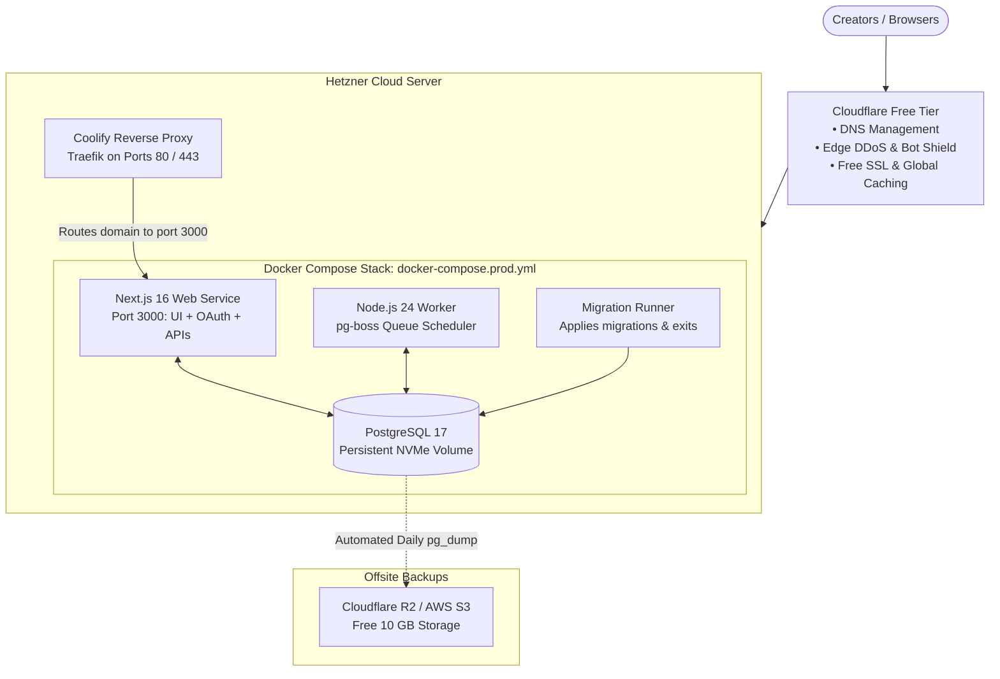

# Complete Production Deployment Guide: Hetzner Cloud VPS + Coolify

This guide details how to deploy and run the entire **Social Publisher** SaaS in one place using a **Hetzner Cloud VPS** and **Coolify** (the open-source self-hosted PaaS).

---

## Why Hetzner Cloud + Coolify?

| Feature                  | Hetzner + Coolify                | AWS / Google Cloud      | Railway / Render          |
| :----------------------- | :------------------------------- | :---------------------- | :------------------------ |
| **Monthly Cost**         | **€6 – €8 / month flat**         | $120 – $180 / month     | $15 – $46 / month         |
| **Included Bandwidth**   | **20,000 GB (20 TB) FREE**       | 0 GB ($0.09–$0.12/GB)   | 0–100 GB ($0.05–$0.15/GB) |
| **Database Network Fee** | **$0 (Internal Docker bridge)**  | Inter-AZ egress fees    | $0 (Internal network)     |
| **Worker Execution**     | **24/7 Persistent Node process** | ECS Fargate containers  | Native worker container   |
| **Git Push Deployments** | **Automatic on push to `main`**  | Complex CI/CD pipelines | Automatic                 |
| **Automated Backups**    | **Built-in S3 / Cloudflare R2**  | RDS snapshots ($)       | Manual or paid add-on     |

---

## Architecture Overview



---

## Step 1: Provision a Hetzner Cloud VPS

1. Sign up or log into [Hetzner Cloud Console](https://console.hetzner.cloud/).
2. Click **+ New Project** and name it `social-publisher`.
3. In the project, go to **Security** -> **SSH Keys** and add your public SSH key (`cat ~/.ssh/id_ed25519.pub` or `cat ~/.ssh/id_rsa.pub`).
4. Go to **Servers** -> **Add Server**:
   - **Location**:
     - _Europe_: **Falkenstein** or **Nuremberg** (lowest latency for EU/Asia/Africa).
     - _USA_: **Ashburn, VA** or **Hillsboro, OR** (lowest latency for Americas).
   - **Image**: **Ubuntu 24.04 LTS**.
   - **Type**:
     - **CPX21** (Recommended): 3 AMD vCPUs, 4 GB RAM, 80 GB NVMe SSD, **20 TB traffic** (~€7.05 / mo).
     - _Alternative_: **CX22**: 2 Intel vCPUs, 4 GB RAM, 40 GB NVMe SSD, **20 TB traffic** (~€3.79 / mo).
   - **Firewall**: Create a firewall with the following inbound rules:
     - `TCP 22` (SSH)
     - `TCP 80` (HTTP)
     - `TCP 443` (HTTPS)
     - `TCP 8000` (Coolify Web UI dashboard)
     - _Notice: Port 5432 (PostgreSQL) is NEVER opened to the public internet._
   - **SSH Keys**: Select your added SSH key.
   - **Name**: `social-publisher-prod`.
5. Click **Create & Buy Now**. Note down the public **IPv4 Address** assigned to your server.

---

## Step 2: Install Coolify with One Command

1. Open your local terminal and connect to your new Hetzner server:
   ```bash
   ssh root@<YOUR_SERVER_IP>
   ```
2. Run the official Coolify installation script:
   ```bash
   curl -fsSL https://cdn.coolify.io/coolify/install.sh | bash
   ```
   _Installation typically takes 2 to 3 minutes. The script automatically installs Docker Engine, Docker Compose, and provisions Coolify with Traefik._
3. Once completed, open your browser and navigate to:
   ```text
   http://<YOUR_SERVER_IP>:8000
   ```
4. Create your master admin account (Name, Email, Password).

---

## Step 3: Configure Domain & Cloudflare (Free Tier)

1. Add your custom domain (e.g. `socialpublisher.com`) to [Cloudflare](https://dash.cloudflare.com/) (Free plan).
2. Go to **DNS** -> **Records** and add:
   - **Type**: `A`
   - **Name**: `@` (or `app`)
   - **IPv4 address**: `<YOUR_SERVER_IP>`
   - **Proxy status**: `Proxied` (Orange cloud icon enabled).
3. Go to **SSL/TLS** -> **Overview**:
   - Set encryption mode to **Full (Strict)**.

---

## Step 4: Deploy Social Publisher in Coolify

1. In the Coolify dashboard, click **Projects** -> **+ New Project** -> Name it `Production`.
2. Select your environment (`production`).
3. Click **+ New Resource** -> **Git Repository**.
4. Connect your Git repository:
   - If using a private GitHub repository, select **GitHub App** and authorize Coolify, or choose **Public Repository** / **Git Deploy Key**.
   - Repository URL: `https://github.com/mayur2605/social-publisher.git`
   - Branch: `main`.
5. Under **Build Pack**, select:
   👉 **Docker Compose**
6. In **Docker Compose Location**, set:
   👉 `/docker-compose.prod.yml`
7. Under **Domains**, enter your production domain:
   ```text
   https://socialpublisher.com
   ```
   _(Coolify automatically routes incoming HTTPS traffic for this domain to port 3000 of the `web` container with Let's Encrypt SSL)._

---

## Step 5: Configure Production Environment Variables

In Coolify, go to the **Environment Variables** tab for your new resource and paste the required production values:

```env
# Database Settings
POSTGRES_USER=publisher
POSTGRES_PASSWORD=generate_a_secure_32_char_password_here
POSTGRES_DB=publisher

# Application Security & Origins
BETTER_AUTH_SECRET=generate_with_openssl_rand_base64_32
BETTER_AUTH_URL=https://socialpublisher.com
ENCRYPTION_KEY=generate_with_openssl_rand_hex_16

# Google OAuth & Drive
GOOGLE_CLIENT_ID=your-google-client-id.apps.googleusercontent.com
GOOGLE_CLIENT_SECRET=your-google-client-secret
GOOGLE_PICKER_API_KEY=your-google-picker-api-key
GOOGLE_PROJECT_NUMBER=your-google-project-number

# Meta (Instagram Professional & Facebook Pages)
META_APP_ID=your-meta-app-id
META_APP_SECRET=your-meta-app-secret

# TikTok
TIKTOK_CLIENT_KEY=your-tiktok-client-key
TIKTOK_CLIENT_SECRET=your-tiktok-client-secret

# Stripe Subscriptions
STRIPE_SECRET_KEY=sk_live_...
STRIPE_WEBHOOK_SECRET=whsec_...
STRIPE_PRICE_STARTER=price_...
STRIPE_PRICE_CREATOR=price_...
STRIPE_PRICE_PRO=price_...
STRIPE_PRICE_STUDIO=price_...

# Operator Info
LEGAL_ENTITY_NAME=Your Company LLC
SUPPORT_EMAIL=support@yourcompany.com
```

> [!TIP]
> To generate high-entropy keys on your Mac terminal:
>
> ```bash
> # For BETTER_AUTH_SECRET:
> openssl rand -base64 32
>
> # For ENCRYPTION_KEY (must be exactly 32 hex characters):
> openssl rand -hex 16
>
> # For POSTGRES_PASSWORD:
> openssl rand -hex 24
> ```

---

## Step 6: Deploy & Verify

1. In the Coolify dashboard, click **Deploy**.
2. Coolify will:
   - Build the Next.js standalone container (`web`).
   - Build the migration and background worker container (`worker`).
   - Start the isolated PostgreSQL 17 database (`db`) with persistent NVMe storage.
   - Automatically execute all checked-in SQL migrations (`migrate`).
   - Bind your domain with SSL.
3. Test your live deployment:
   ```bash
   curl -s https://socialpublisher.com/api/health
   ```
   Expected response:
   ```json
   { "database": true, "worker": true }
   ```
4. Complete provider callback verification:
   - In Google Cloud Console: add `https://socialpublisher.com/api/auth/callback/google` and `https://socialpublisher.com/api/connections/drive/callback`.
   - In Meta App Dashboard: add `https://socialpublisher.com/api/connections/meta/callback`.
   - In TikTok Developer Portal: add `https://socialpublisher.com/api/connections/tiktok/callback`.
   - In Stripe Dashboard: add webhook URL `https://socialpublisher.com/api/stripe/webhook` listening for `customer.subscription.updated` and `customer.subscription.deleted`.

---

## Step 7: Automated Offsite Database Backups

To ensure zero data loss:

1. In the Coolify dashboard, click on your PostgreSQL service (`db`).
2. Navigate to the **Backups** tab.
3. Select **S3 Storage** (Cloudflare R2 is 100% free for up to 10 GB of stored backups with $0 egress fees).
4. Enter your R2 / S3 access keys, bucket name, and endpoint.
5. Set the backup schedule:
   ```cron
   0 2 * * *
   ```
   _(Executes a complete compressed `pg_dump` every night at 2:00 AM)._

---

## Day-2 Operations

- **Automatic Deployments**: Whenever you push commits to `origin/main` on GitHub, Coolify receives the webhook and automatically initiates a zero-downtime rolling update.
- **Worker Scaling**: If your scheduled publishing volume increases, you can scale the worker service concurrency directly in `src/worker/index.ts` without needing any infrastructure changes.
- **Resource Monitoring**: View real-time CPU, RAM, and disk utilization charts directly in the Coolify dashboard.
