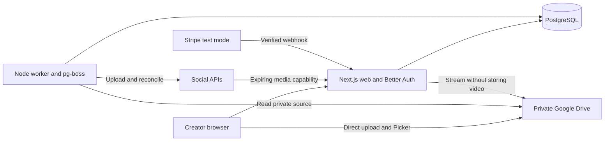

# 3. Technical specification

Version 1.0 · 2026-09-22 · Owner: engineering · Baseline: `7265f91`

## Architecture and trust boundaries

Next.js/TypeScript serves the UI, Better Auth routes, and owner-scoped application API. PostgreSQL stores identity/session data, encrypted grants, media metadata, posts, per-destination state, billing, and usage. A separate Node.js pg-boss worker performs publishing independently of browser sessions. Hetzner Cloud VPS + Coolify is the primary production deployment target (using `docker-compose.prod.yml` with 20 TB free monthly video bandwidth); Railway is supported as an alternative managed PaaS (`railway.web.toml` and `railway.worker.toml`); Docker Compose is provided locally (`compose.yaml`).



The browser may receive a scoped Drive access token for Picker and an upload-session URL. Refresh tokens and app secrets remain server-side. Meta's streaming URL is a bearer capability, not a public Drive permission: possession grants temporary access to that destination's source while the server's state checks permit it.

## Identity and authorization

`src/lib/auth.ts` uses Better Auth's PostgreSQL integration, Google identity, seven-day database sessions, disabled cookie cache, disabled account linking, explicit trusted origin, production secure cookies, and database auth rate limits. `/api/auth/[...all]` mounts the Next.js handler; Google's identity callback is `/api/auth/callback/google`.

Application API handlers validate the session and scope resources to its user ID. Mutations enforce the configured Origin. Provider callbacks validate dedicated OAuth state associated with the existing app user. The Stripe webhook uses signature verification instead of a browser session; streaming uses a signed, expiring destination capability. Public health and legal routes intentionally expose no user records.

Current pages render a workspace shell and fetch protected data through authenticated APIs. The original plan also calls for page-level session validation: review/add server-side protected-page handling before release rather than claiming the shell itself performs that check. Future server actions must independently validate sessions and ownership.

## Data model

| Record                                                          | Purpose and constraints                                                                                                                            |
| --------------------------------------------------------------- | -------------------------------------------------------------------------------------------------------------------------------------------------- |
| Better Auth user/session/account/verification/rate-limit tables | Generated authentication schema; app owner IDs reference the auth user                                                                             |
| connections / oauth_states                                      | Owner/provider/external identity, encrypted grants, connection health; one non-disconnected Drive per owner; short-lived state for dedicated OAuth |
| media / upload_sessions                                         | Drive file ID, checksum, dimensions, duration, size; encrypted resumable session references; no video bytes                                        |
| posts                                                           | Source, shared caption, chosen timezone, UTC schedule                                                                                              |
| destinations                                                    | Unique post/connection pair; options, state, remote identifiers, upload checkpoints, attempt count, consecutive failure budget, due time, lease    |
| subscriptions / billing_events                                  | Stripe identity, plan, billing period, status, checkout reuse, event deduplication                                                                 |
| usage                                                           | One record per destination; period and reserved/consumed/released state                                                                            |
| publish_attempts / worker_heartbeats                            | Outcome audit and worker freshness                                                                                                                 |

Migrations `000`–`003` are checked in. Generate future Better Auth deltas into `.local/`, review them, and add a new migration; never overwrite applied SQL. Back up before deployment. PostgreSQL timestamps store instants; `posts.timezone` preserves creator intent.

## Application interfaces

All paths below are prefixed `/api`. JSON failures use `{ "error": "message" }`; validation is 400, authentication 401, authorization/origin 403, missing resources 404, missing configuration 503, provider failures 502. OAuth callbacks redirect to the app.

| Method and route                        | Contract                                                                                                        |
| --------------------------------------- | --------------------------------------------------------------------------------------------------------------- |
| GET workspace                           | Owner's accounts, recent media/posts, subscription, usage, capabilities                                         |
| POST connections/authorize/:provider    | Returns consent URL; provider is drive, youtube, meta, or tiktok                                                |
| GET connections/callback/:provider      | Exchanges validated consent; does not replace app identity                                                      |
| DELETE connections/:id                  | Disconnect and pause pending work                                                                               |
| POST connections/:id/active             | `{active:boolean}`; enforce account cap                                                                         |
| GET connections/:id/creator             | Current TikTok creator options                                                                                  |
| POST drive/picker                       | Authenticated Picker access token/configuration                                                                 |
| POST drive/upload                       | `{name,mimeType,size}`; initiate direct resumable upload                                                        |
| POST drive/import                       | `{fileId}`; validate/store Drive metadata                                                                       |
| GET or HEAD media/:id/preview           | Owner-authenticated video stream                                                                                |
| GET or HEAD media/stream/:destinationId | Signed `expires`/`signature` capability; supports a single forward byte range                                   |
| POST posts / PATCH posts/:id            | Source, caption, timezone, ISO timestamp or null, draft/schedule/now mode, destination connection/options array |
| POST posts/:id/cancel                   | Cancel before dispatch; locking coordinates worker                                                              |
| POST destinations/:id/retry             | Failed/paused retry; attention with recoverable remote ID preserves checkpoint                                  |
| POST destinations/:id/resolve           | `{resolution:"published" or "not_published",confirmed:true}` after creator review                               |
| POST billing/checkout / billing/portal  | Selected plan or existing customer; returns Stripe URL                                                          |
| POST billing/webhook                    | Raw body and Stripe signature; verified and deduplicated                                                        |
| DELETE account                          | `{confirmation:"DELETE"}`; refuses active/uncertain work and preserves remote originals                         |
| GET health                              | Database and worker freshness; stack health rather than isolated web readiness                                  |

Example post request (IDs are illustrative, not seed data):

```json
{
  "mediaId": "00000000-0000-4000-8000-000000000001",
  "caption": "A day in the studio",
  "timezone": "Asia/Kolkata",
  "scheduledAt": "2026-10-01T18:00:00+05:30",
  "mode": "schedule",
  "destinations": [
    {
      "connectionId": "00000000-0000-4000-8000-000000000002",
      "options": {
        "title": "Studio day",
        "privacy": "private",
        "madeForKids": false
      }
    }
  ]
}
```

Scheduled posts require at least one minute of lead time at submission. Current workspace queries return up to 100 media and 100 posts; pagination is a backlog item before usage exceeds those bounds.

## Worker and publishing protocol

The worker polls due records every ten seconds and uses pg-boss with three local workers. Per-destination advisory locks serialize side effects; a user shared lock coordinates account deletion/disconnection. Re-read state after lock acquisition, honor `next_attempt_at`, and retain remote checkpoints. A lease assists discovery but is not the sole duplicate-prevention mechanism.

Normal progression is draft → scheduled/queued → processing → published. Confirmed rejection becomes failed; missing entitlement/grant before upload can become paused; an uncertain side effect becomes attention. Cancellation is allowed before dispatch. Explicit review resolves attention; successful destinations are terminal for automatic publishing. Cancellation of a remote operation already accepted is not promised.

YouTube probes a resumable session before 8 MiB chunks; TikTok checkpoints upload/publish IDs and chunk acknowledgements; Instagram creates and polls a container before publication; Facebook handles Video and Reel operations with saved IDs. Adapters expose validate/upload/publish/reconcile, currently backed by a shared state machine per platform. A method named reconcile is not inherently read-only in this baseline.

Transient errors have up to twelve automatic retries with exponential backoff capped at 30 minutes. Successful adapter steps reset consecutive failures; ordinary polling/chunks do not consume that budget. Long-running pending results have a separate attempt guard. Unknown outcomes keep their reservation and require reconciliation or explicit review rather than blind reposting.

## Integrity, billing, and secrets

Source requests check Drive ID-associated metadata, size, and checksum; changed/inaccessible files fail visibly. Signed Meta source links last 24 hours and are checked against destination/connection state. OAuth tokens and upload session secrets are encrypted with AES-256-GCM; the configured 32-byte key also signs streaming capabilities. Key rotation needs ciphertext migration and invalidation planning.

Quota reservation locks the subscription row. A unique usage destination prevents double charging. Dual quotas enforce both monthly post limits and monthly bandwidth pools (Starter 40 GB, Creator 120 GB, Pro 300 GB, Studio 750 GB) alongside 500 MB short-form vertical video caps. Stripe events are signed, deduplicated transactionally, and reconciled against current subscription state. Test keys/events only are accepted. Expired entitlement prevents dispatch. Inspect in-flight reconciliation at subscription expiry as a hardening item: current reservation checks run on each worker pass.

## Known engineering work before acceptance

- Verify protected-page session handling and all future server actions against FR-01/NFR-01.
- Measure large transfer throughput (2 GiB on Starter/Creator/Pro, 10 GiB on Studio): one chunk per worker pass plus scheduling delays may be too slow; optimize only with recovery tests.
- Test subscription expiry/downgrade while a remote operation is processing; ensure reconciliation and reservation settlement remain possible without starting unauthorized new posts.
- Test actual worker termination, source revisions, token revocation, provider host responses, and byte-range behavior.
- Validate concurrent first deployment/migrations, database restore, and production pool capacity.
- Review pagination, API resource limits, accessibility, log redaction, and dependency security before broad registration.

These are tracked in [phase 4](04-implementation-roadmap.md); their presence here is not a claim that they have been fixed.

## Detailed contracts and assurance

See [OpenAPI and auth boundary](../api/README.md), [product design](../design/product-design.md), [threat register](../security/threat-model.md), [dependency/build policy](../engineering/dependencies.md), and [cross-document audit](../documentation-audit.md). Browser-to-Drive resume currently depends on the active page's in-memory file/session references; the encrypted upload-session table has no owner-facing retrieval API. T037 tracks the product decision and any additional recovery implementation. T038 tracks auxiliary auth/upload records and vendor-route deletion review.
